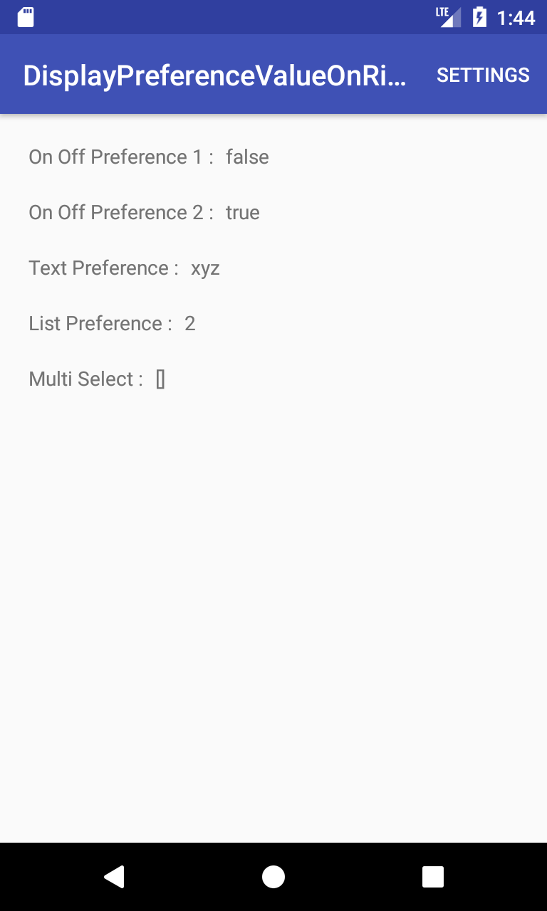
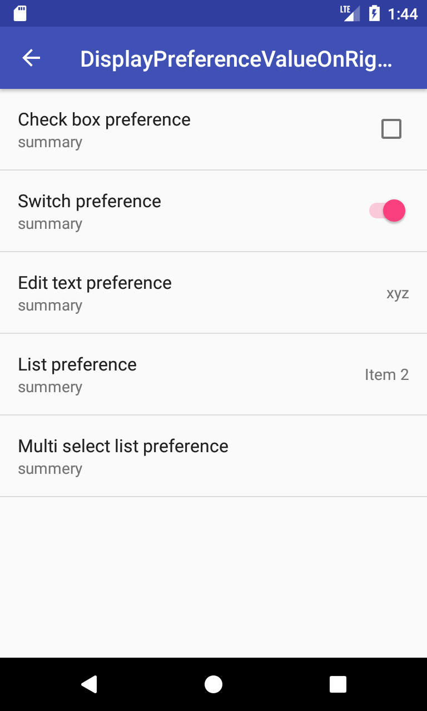
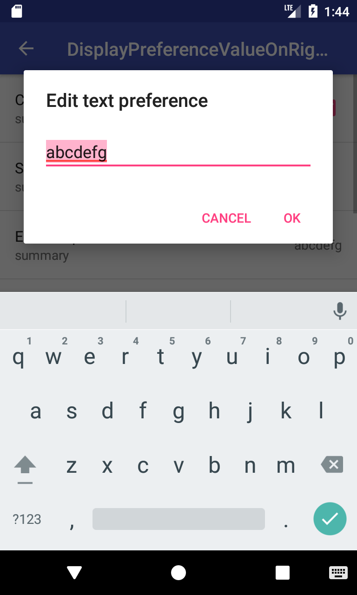
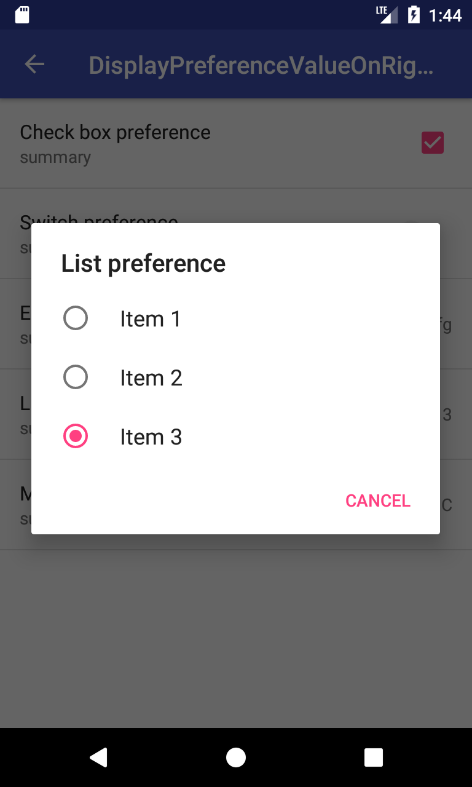
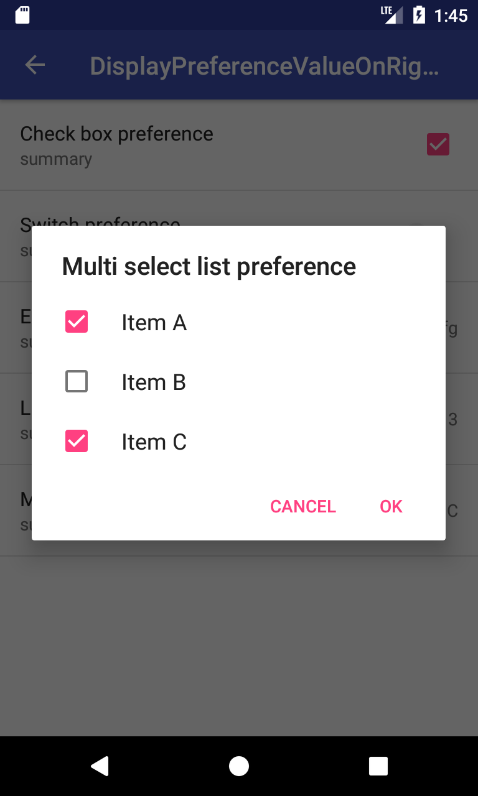
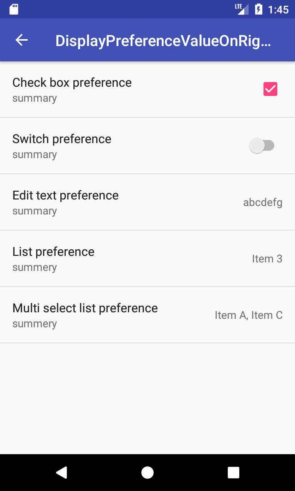
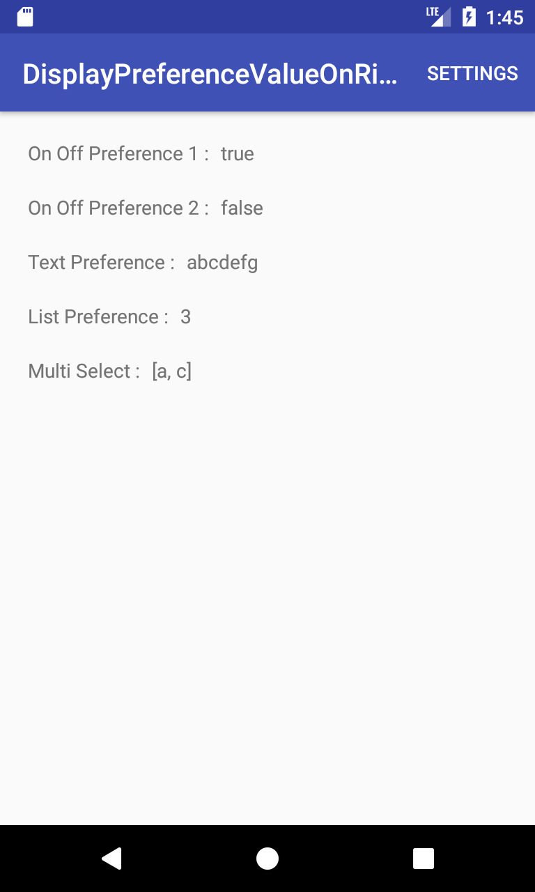

# DisplayPreferenceValueOnRightSide
Preference値を設定項目の右側に表示する方法。

要点としては、
- XXXXPreferenceクラスの派生クラスを作成する。
- onCreateView関数をオーバーライドし、setWidgetLayoutResource関数で、TextViewを登録する。
- onBindView関数をオーバーライドし、textView.setText関数で、TextViewにPreference値を設定する。

## Screenshots : スクリーンショット
      

## Requirements : 必要条件、依存関係
- Android Studio 2.3.3
- Android SDK 25
- Android Build Tools v26.0.0
- Android Support Repository

## Author : 作者
Nobuki HIRAMINE : http://www.hiramine.com

## License : ライセンス
Copyright 2018 Nobuki HIRAMINE  
The source code is licensed under the Apache License, Version 2.0.  
See the [LICENSE](LICENSE) file for more details.  
(本アプリケーションのソースコードのライセンスは、「Apache License, Version 2.0」です。  
詳細は「[LICENSE](LICENSE)」ファイルを参照ください。)

